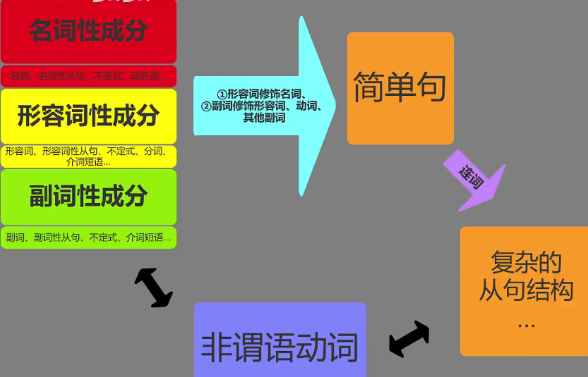

# 第一章 换一种方式理解词性

## 1.1 名词，形容词，副词，这就是一切

### 1.1.1 词性

1. 名词性成分:名词，名词性从句，不定式，动名词...
2. 形容词成分: 形容词，形容词性从句，不定式，分词，介词短语
3. 副词性成分:副词，副词性从句，不定式，介词短语

### 1.2 词性之间的修饰关系

1. 形容词修饰名词
2. 副词修饰形容词，动词，其他副词

| No. | 词性                 | 转换    |
| --- | -------------------- | ------- |
| 1   | 名词(Noun)           | n       |
| 2   | 动词(Verb)           |         |
| 3   | 形容词(Adjective)    | adj     |
| 4   | 副词(Adverb)         | adv     |
| 5   | 代词(Pronoun)        | n       |
| 6   | 介词(Preposition)    | adj/adv |
| 7   | 连词(Conjunction)    |         |
| 8   | 感叹词(Interjection) |         |
| 9   | 冠词(Article)        | n       |
| 10  | 数词(Numeral)        | n/adj   |
| 11  | 限定词               | n       |

#### 1.2.1 例子

1. 形容词修饰名词: The **beautiful** _flowers_ have a sweet fragrance.
2. 副词修饰形容词: Her performance was **surprisingly** _good_.
3. 副词修饰动词: He _runs_ **slowly**.
4. 副词修饰其他副词: She speaks **very** _slowly_.

#### 1.2.2 成分

- 形容词成分修饰名词性成分
  - 形容词 The **beautiful** _flowers_ have a sweet fragrance.
  - 形容词从句 The _flowers_ **which are stolen from Michael** have a sweet fragrance.
  - 分词 The _flowers_ **stolen from Michael** have a sweat fragrance.
- 副词性成分修饰形容词成分
  - 副词 Her performance was **surprisingly** _good_.
  - 副词性成分 Her performance was _good_ **when her mon is around**.
- 副词性成分修饰动词
  - 副词 He _runs_ **slowly**.
  - 副词性从句 He _runs_ **if he is followed**.
- 副词性成分修饰其他副词性成分
  - 副词 She _speaks_ very **softly**.
  - 副词性介词短语 She _speaks_ **like a gun**.

### 1.3 介词 = 形容词或副词

#### 1.3.1 用法

> 介词 + 名词性成分=介词短语

- up
  - 介词 The puma is **up a tree**
  - 副词 He looked **up**
  - 形容词 Prices are **up**
- on
  - 介词 It depends **on what they do.**
  - 副词 The car stopped and then drove **on**.
  - 形容词 The TV is **on**.

#### 1.3.2 例子

1. 名词短语 The cat **on the table** is named Floppy.
2. 名词短语 He walked **through the park**.
3. 分词短语 She apologized **for arriving late to the meeting**.
4. 名词性从句 She's not certain **about whether she'll go to the party or not.**
5. 名词短语 The Scientists are studying the effects of climate change **on the ecosystem.**
6. 嵌套名词从句的名词短语 I'm worried **about the fact that I haven't heard from him in a while.**

#### 1.3.3 形容词属性的介词短语

> 形容词属性的介词短语一般用作后置定语，用来修饰名词

1. _The book_ **on the shelf** is great.
2. I hate _the hot summers_ **in Changsha**.

#### 1.3.4 副词属性的介词短语

> 副词属性的介词短语用于修饰动词，形容词，以及其他副词

1. 修饰动词

- We _went_ to movie **after dinner**.
- They _have_ classes **at our local school.**

2. 修饰形容词

- I am _ready_ **for dinner**.
- Sally is _happy_ **with her new teacher**.

3. 修饰其他副词:

- We got there _late_ **in the evening.**
- Our team scored _early_ **in the first quarter.**

#### 1.3.5 这些也是介词

1. 简单介词 as,at,by,during,with...

2. 分词介词 

   | 分词介词    | 中文   |
   | ----------- | ------ |
   | considering | 考虑到 |
   | including   | 包括   |
   | given       | 考虑到 |
   | granted     | 因为   |

   

3. 短语介词 ahead of, next to,because of, owning to,along with,as well as,in case of,in charge of, in common with, as a result of,in the absence of,to the best of,with an eye to...

   | 短语介词          | 中文      |
   | ----------------- | --------- |
   | Ahead of          | 在...前面 |
   | next to           | 在...旁边 |
   | Because of        | 因为      |
   | Owning to         | 由于      |
   | along with        | 随着      |
   | as well as        | 也        |
   | in case of        | 万一      |
   | in charge of      | 负责      |
   | in common with    | 与...想通 |
   | as a result of    | 由于      |
   | in the absence of | 缺少...时 |
   | to the best of    | 尽力而为  |
   | with an eye to    | 考虑到    |

   
